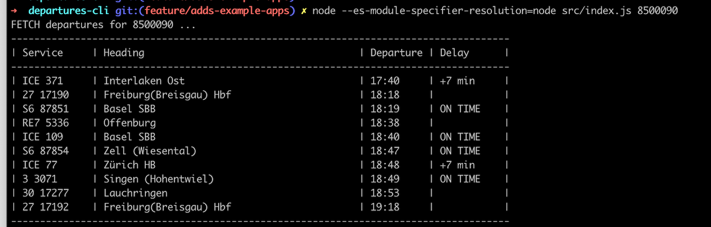

# Departures CLI

This is a command-line Node JS application created to demonstrate the capabilities of the OJP-JS SDK.



## Steps

- create new Node JS application: `$ npm init`
- adds `ojp-sdk` inside package.json `dependencies` section
- install dependencies via `$ npm install`
- includes and use OJP-JS SDK, see [./src/index.js](./src/index.js) JavaScript file
```
import * as OJP from 'ojp-sdk'

...

const request = OJP.StopEventRequest.initWithStopPlaceRef(OJP.DEFAULT_STAGE, stopRef, 'departure', new Date());
```
- run the main script in the terminal
```
$ node src/index.js 8500090

# older node <18.x
$ node --es-module-specifier-resolution=node src/index.js 8500090
```
