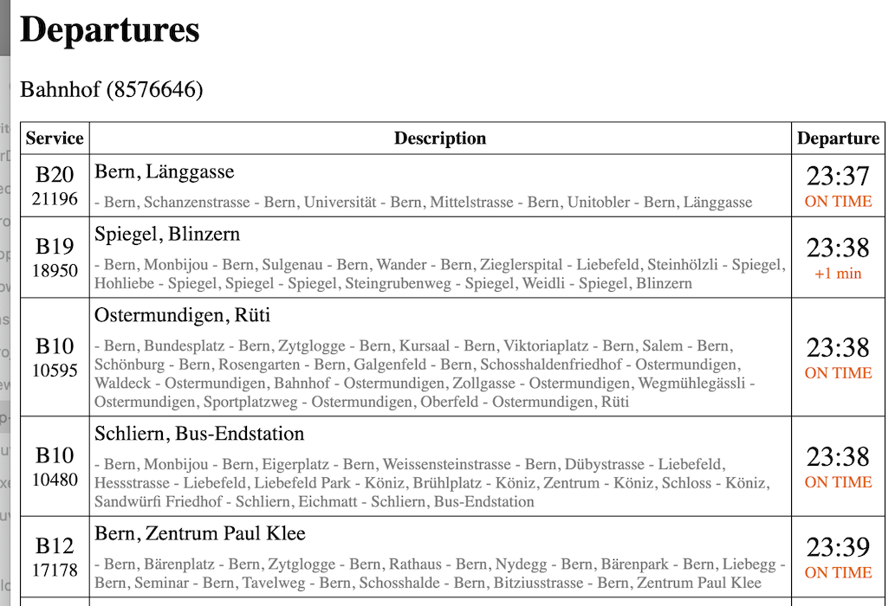

# Departures Web App

This is an Angular web-application created to demonstrate the capabilities of the OJP-JS SDK.



## Steps

- create new Angular application with [Angular CLI](https://github.com/angular/angular-cli): `$ ng new departures-webapp`
- adds `ojp-sdk` inside package.json `dependencies` section
- install dependencies via `$ npm install`
- serve the application locally `$ ng serve`
- includes and use OJP-JS SDK, see [./src/app/app.component.ts](./src/app/app.component.ts) Typescript file
```
import * as OJP from 'ojp-sdk'

...

const request = OJP.StopEventRequest.initWithStopPlaceRef(OJP.DEFAULT_STAGE, stopRef, 'departure', new Date());
```
  

